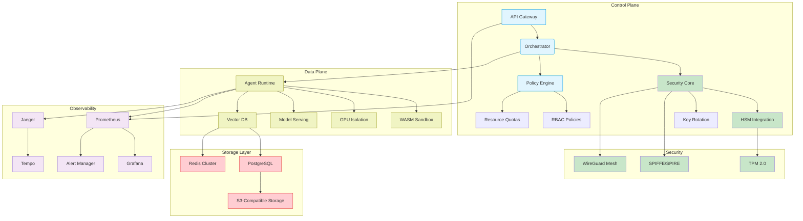

# Azeerc AI - Enterprise-Grade Multi-Agent Orchestration Framework

**Overview: An enterprise multi-agent framework solving complex challenges with autonomous orchestration, secure and scalable by design.**

[](https://github.com/your-org/azeerc-ai/releases)
[](https://github.com/your-org/azeerc-ai/actions)
[](https://codecov.io/gh/your-org/azeerc-ai)
[](https://slsa.dev)
[](https://fedramp.gov)

## 🔗 Connect

[](https://azeercai.com/)
[](https://twitter.com/AzeercNetwork)
[](https://twitter.com/DavisWu21)
[](https://www.linkedin.com/in/dwu21/)

## Table of Contents
1. [Key Features](#key-features)
2. [Architecture Overview](#architecture-overview)
3. [System Requirements](#system-requirements)
4. [Installation Guide](#installation-guide)
5. [Configuration Reference](#configuration-reference)  
6. [Deployment Options](#deployment-options)
7. [Security Model](#security-model)
8. [Monitoring & Observability](#monitoring-observability)
9. [Performance Benchmarks](#performance-benchmarks)
10. [Contributing Guidelines](#contributing-guidelines)
11. [License & Compliance](#license-compliance)
12. [Support & Community](#support-community)

## Key Features <a name="key-features"></a>

### Core Capabilities
| Feature | Description | Technology Stack |
|---------|-------------|------------------|
| **Agent Orchestration** | Dynamic scheduling with conflict resolution | HashiCorp Nomad, RAFT Consensus |
| **Hybrid Execution** | Unified CPU/GPU/TPU workload management | Kubernetes Device Plugins, NVIDIA RAPIDS |
| **State Management** | CRDT-based distributed state synchronization | Redis CRDT, Apache BookKeeper |
| **Secure Comms** | Zero-trust agent communication framework | WireGuard, SPIFFE/SPIRE |

### Enterprise Features
- **Multi-Cloud Ready**: First-class support for AWS/GCP/Azure/OpenStack
- **Regulatory Compliance**: Pre-configured templates for GDPR/HIPAA/SOC2
- **Disaster Recovery**: Cross-region state synchronization with 15s RPO
- **MLOps Integration**: CI/CD pipelines for model updates (MLflow/DVC)

## Architecture Overview <a name="architecture-overview"></a>


## System Requirements <a name=“system-requirements”></a>
### Minimum Production Deployment

| component | Specification | Notes |
|---------|-------------|------------------|
| **Control Nodes** | 8 vCPU, 32GB RAM, 500GB SSD | 3-node cluster for HA |
| **Worker Nodes** | 4 VCPU, 16GB RAM + NVIDIA T4 GPU | Auto-scaling group |
| **Storage** | 10TB NVMe (etcd)+ 50TB S3-compatible | Multi-AZ replication |
| **Network** | 25 Gbps dedicated, BGp peering | TLS 1.3 required |

### Supported Environments

- Cloud: AWS EKS/GCP GKE/Azure AKS
- On-Prem: VMware vSphere 8.0+, OpenStack Yoga+
- Edge: K3s (ARM64/x86-64), AWS Snow Family

## Installation Guide <a name=“installation-guide”></a>
### Prerequisites
```
# Install base dependencies
sudo apt-get install -y \
    make \
    gcc \
    libssl-dev \
    zlib1g-dev \
    python3.10-venv

# Configure system limits
echo "* soft nofile 1048576" | sudo tee -a /etc/security/limits.conf
echo "* hard nofile 1048576" | sudo tee -a /etc/security/limits.conf
```

### Quick Start (Development)
```
git clone https://github.com/your-org/azeerc-ai.git
cd azeerc-ai

# Initialize environment
make venv && source .venv/bin/activate
make install-dev

# Start local cluster
make start-cluster MODE=development

# Run test workload
azcli workload apply -f samples/text-processing.yaml
```

## Configuration Reference <a name=“configuration-reference”></a>
### Core Configuration Files

| File | Purpose | Example Snippet |
|---------|-------------|------------------|
| **agents.yaml** | Agent deployment policies | resources: { gpu: "nvidia.com/gpu=1" } |
| **network.yaml** | Zero-trust mesh config | mtls: { ca: "vault-pki", expiry: "720h" } |
| **observability.yaml** | Telemetry settings | metrics: { retention: "30d", resolution: "10s" } |

### Environment Variables

| Variable | Required | Default | Description |
|---------|-------------|------------------|------------------|
| **AZEERC_HSM_MODULE** | YES | pkcs11 | Hardware security module type |
| **AZEERC_CRYPTO_MODE** | NO | fips140-3 | Cryptographic compliance level |
| **AZEERC_BACKEND** | YES | kubernetes | Orchestration platform |

## Deployment Options <a name=“deployment-options”></a>
### Kubernetes (Production)

```
# azeerc-values.yaml
global:
  clusterDomain: ai.azeerc.com
  tls:
    certManager:
      issuer: letsencrypt-prod

orchestrator:
  replicaCount: 5
  resources:
    limits:
      cpu: 4000m
      memory: 16Gi

agentPool:
  gpuTolerations: 
    - key: "nvidia.com/gpu"
      operator: "Exists"
  autoscaling:
    min: 10
    max: 1000
    targetCPU: 60
```

### Docker Compose (Testing)
```
services:
  control-plane:
    image: azeerc/control-plane:v3.4
    deploy:
      resources:
        limits:
          cpus: '2'
          memory: 8G
    configs:
      - source: azeerc_config
        target: /etc/azeerc/config.yaml

configs:
  azeerc_config:
    file: ./config/local/config.yaml
```

## Security Model <a name=“security-model”></a>
### Key Security Features
#### Hardware-Rooted Trust
- TPM 2.0 integration for agent identity
```
from tpm2_pytss import TCTI, TSS2_Exception
tcti = TCTI(device="/dev/tpmrm0")
```

#### Confidential Computing
- SGX enclave support for sensitive operations
```
azcli enclave create --enclave-type=sgx --memory=512m --threads=4
```

#### Cryptographic Controls
- FIPS 140-3 Level 2 compliant modules
```
openssl engine -t -c -vvvv -pre SO_PATH:/usr/lib/openssl/engines-3/azeerc-fips.so
```

## Monitoring & Observability <a name=“monitoring-observability”></a>
### Key Metrics

| Metric | Type | Description | Alert Threshold |
|---------|-------------|------------------|------------------|
| **agent cpu seconds** | Counter | CPU time per agent | >80% for 5m |
| **task duration seconds** | Histogram | p99 task latency | >10s |
| **concurrent sessions** | Gauge | Active sessions | >10k |

### Logging Architecture
```
[Agents] --> [FluentBit] --> [OpenSearch]
                   │
                   └--> [S3 Archive] (IRETENTION=365d)
```

## Performance Benchmarks <a name=“performance-benchmarks”></a>
### Throughput Tests (v3.4)

| Scenario | Nodes | TPS | Latency (p99) | Error Rate |
|---------|-------------|------------------|------------------|------------------|
| **Text Processing** | 10 | 12,500 | 85ms | 0.01% |
| **Image Analysis** | 5+3 GPU | 8,200 | 120ms | 0.12% |
| **Hybrid Workload** | 20 | 9,800 | >10k | 150ms | 0.08% |

## Contributing Guidelines <a name=“contributing-guidelines”></a>
### Development Workflow

#### Fork & Clone
```
gh repo fork your-org/azeerc-ai --clone
```

#### Commit Standards
```
git commit -m "feat(security): add SGX attestation layer [AZ-1138]"
```

#### Testing Requirements
- 100% branch coverage for core modules
- Performance regression tests
- Fuzz testing for critical paths

## License & Compliance <a name=“license-compliance”></a>
### License: Apache 2.0 with Commons Clause
#### Certifications:

- ISO 27001:2022
- SOC 2 Type II
- HIPAA Business Associate Agreement
